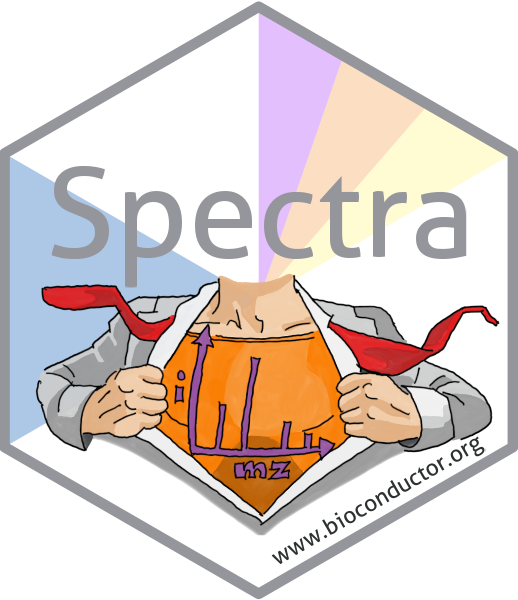
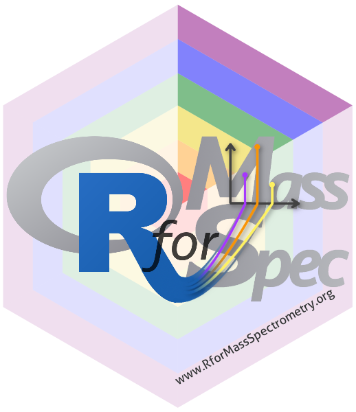

# Logos and stickers

This repository contains the [logo](logo/README.md) for the
**RforMassSpectrometry** organisation, stickers and other layouts.

# Diversity-affirming versions

# License

You can distribute the logo under the terms of the Creative Commons
Attribution-ShareAlike 4.0 International license [CC-BY-SA
4.0](https://creativecommons.org/licenses/by-sa/4.0/). The **CC-BY-SA 4.0**
license allows you to share and adapt the logo for any purpose, including
commercial use, provided that you give appropriate credit, provide a link to the
license, and indicate if any changes were made.

The R-logo (copyright The R Foundation) is under the [CC-BY-SA
4.0](https://creativecommons.org/licenses/by-sa/4.0/) license and was downloaded
from [here](https://www.r-project.org/logo/).
